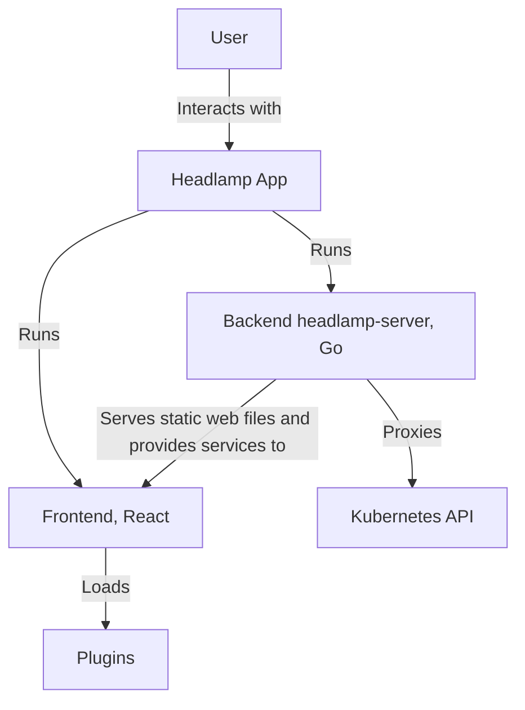
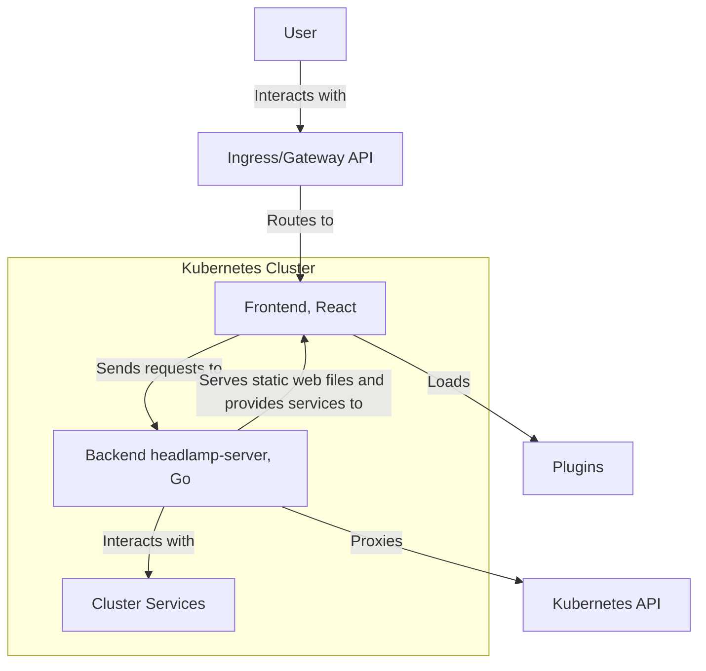
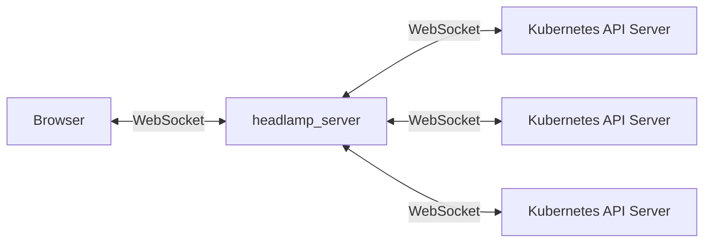
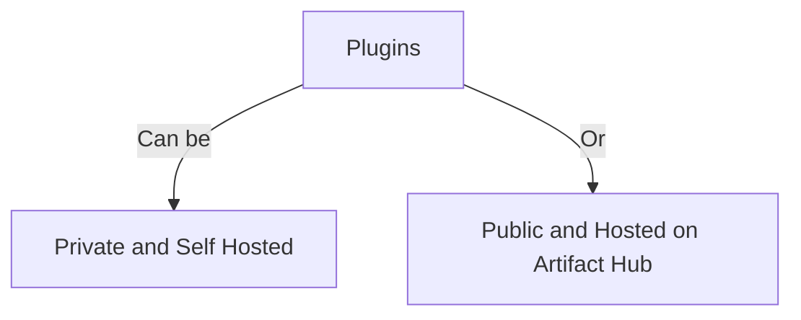
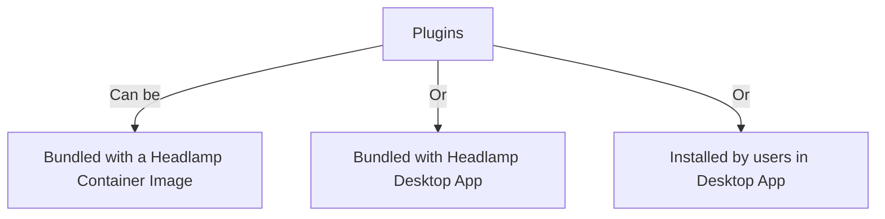

## Introduction

Headlamp is a user-friendly and extensible Kubernetes UI designed to provide a seamless experience for managing Kubernetes clusters. It can connect to one or multiple Kubernetes clusters and can be deployed as a web app in-cluster or as a desktop app. Headlamp can be customized and 

## High-Level Architecture

### Headlamp running as a Desktop App (on MacOS, Windows, Linux etc)

### Headlamp Web App running inside a Kubernetes Cluster

### Headlamp and websockets

Headlamp can use websockets to get soft-realtime UI updates from Kubernetes when things change.

Because web browsers limit the number of websockets that can be created, the headlamp-server 

### Plugins

#### Plugin Hosting Options

Where can plugins be hosted?

#### Plugin Using and Bundling Options

How can plugins be enabled?

## Source Map for Components

Headlamp consists of the following major components:
- **frontend/**: A React-based UI that interacts with the backend to display cluster information and perform actions.
- **backend/**: A Go-based server that communicates with the Kubernetes API and serves data to the frontend.
- **app/**: A native Electron-based application for running Headlamp as a desktop app.
- **plugins/headlamp-plugin**: A component to manage plugins in development and in deployment.
- **plugins/examples**: Examples of how to achieve.
- **docs/**: Documentation that is in markdown, and gets put on the Headlamp Website.

The following components are in separate github repos:
- **Plugins**: Extensible modules that add custom functionality to the UI. The ones maintained by the Headlamp team are in the [headlamp-k8s/plugins repo](https://github.com/headlamp-k8s/plugins). These include plugins for projects like Flux, Backstage and Inspektor Gadget.
- **Headlamp Website**: Maintained in the [headlamp-k8s/website repo](https://github.com/headlamp-k8s/website). This contains things like the blog and the documentation. The website can be found at https://headlamp.dev/

### Makefile task entry point

The headlamp/ repo [Makefile](https://github.com/headlamp-k8s/headlamp/blob/main/Makefile) contains a number of targets for building and testing different components.

### Frontend

- Entry point is [frontend/src/index.tsx](https://github.com/headlamp-k8s/headlamp/blob/main/frontend/src/index.tsx)
- See the [Frontend Documentation](https://headlamp.dev/docs/latest/development/frontend) for more information including a Quickstart.

A few key dependencies:

- **TypeScript**: Written in TypeScript.
- **React Components**: Modular and reusable components that form the UI.
- **Mui**: For UI components it uses Mui a Material UI component library.
- **State Management**: Uses Redux for managing application state.
- **Routing**: Utilizes React Router for navigation within the app.
- **Npm**: Uses npm for package management.

For each component we have a .stories.tsx file. For example Tables.stories.tsx for the Table.tsx component.

### Backend (headlamp-server)

- The [backend/](https://github.com/headlamp-k8s/headlamp/blob/main/backend/) folder contains the source code for the headlamp-server binary.
- Entry point is [backend/cmd/headlamp.go](https://github.com/headlamp-k8s/headlamp/blob/main/backend/cmd/headlamp.go)
- See the [Backend Documentation](https://headlamp.dev/docs/latest/development/backend/) for more information including a Quickstart.

A few key dependencies:
- **Golang**: Written using the [golang]() language. 
- **Gorilla**: is the web framework we use
- **Kubernetes and Helm**: Uses Kubernetes and Helm golang packages.

Packages are stored in the [backend/pkg](https://github.com/headlamp-k8s/headlamp/blob/main/backend/pkg/) folder. The packages available are cache, config, helm, kubeconfig, logger, plugins, portforward, and utils. Future code should be organized in packages. There is still some code inside cmd/ folder that probably should be migrated to separate packages.

For each module we have a test file. For example config.go comes with config_test.go.

### App

- The [app/](https://github.com/headlamp-k8s/headlamp/tree/main/app) folder contains everything to do with the app.
- Entry point is [app/electron/main.ts](https://github.com/headlamp-k8s/headlamp/blob/main/app/electron/main.ts)

The app depends on the frontend/ and the backend/. 

A few key dependencies:
**TypeScript**: Written in TypeScript.
**Electron**: Used to create a native desktop application for Headlamp.
**Yargs**: Used for command line argument processing.

### Plugins

- The [plugins/headlamp-plugin](https://github.com/headlamp-k8s/headlamp/tree/main/plugins/headlamp-plugin) folder contains the headlamp-plugin tool which provides plugin build and management tools.
- [plugins/examples](https://github.com/headlamp-k8s/headlamp/tree/main/plugins/examples) folder contains some example plugins.
- [frontend/src/plugin](https://github.com/headlamp-k8s/headlamp/tree/main/frontend/src/plugin) folder contains frontend code related to plugins.
- [backend/pkg/plugins/](https://github.com/headlamp-k8s/headlamp/tree/main/backend/pkg/plugins/) folder contains backend code related to plugins.
- [headlamp-k8s/plugins repo](https://github.com/headlamp-k8s/plugins) contains plugins maintained by the Headlamp team. Including plugins for projects like Flux, Backstage and Inspektor Gadget.
- See the [Plugin Development Documentation](https://headlamp.dev/docs/latest/development/plugins/) for more information about developing plugins.

A few key dependencies:
**TypeScript**: Written in TypeScript.

## Design Decisions

- **Go for Backend**: Selected because Kubernetes APIs and ecosystem APIs use golang. Also for its performance and concurrency capabilities. 
- **React for Frontend**: Chosen for its component-based architecture and strong community support.
- **Extensibility**: Designed with a plugin system to allow easy customization and extension.
- **Multi-Cluster Support**: Designed to manage multiple Kubernetes clusters from a single interface.
- **Realtime**: Designed to react in real time to changes in clusters.

We ask that people write issues proposing large changes. See more in the [contribution guide](https://headlamp.dev/docs/latest/contributing).

## Invariants

- **Security**: All interactions must be secure, respecting RBAC and authentication mechanisms.
- **Accessibility**: The UI should be accessible to all and empower everyone to manage Kubernetes clusters.
- **Consistency**: The UI must always reflect the current state of the Kubernetes clusters as quickly as is feasible.

## Deployment Options

See the [Installation Documentation](https://headlamp.dev/docs/latest/installation/) for more information including a Quickstart.

As mentioned above, Headlamp can be deployed as a container inside a Kubernetes cluster or as a Desktop app.

## Future Work

For more details on the roadmap and what is tentatively planned for each release, please refer to the [Release Plan / Roadmap](https://github.com/orgs/headlamp-k8s/projects/1/views/1). This is updated as we go, and weekly. As this is an open source project people contribute code and issues outside of what might be mentioned in the roadmap.

Once features are merged into the repos, then it can take some time before they enter a released version of Headlamp. Please see the releases on github for information about released artifacts:
- [Headlamp repo releases](https://github.com/headlamp-k8s/headlamp/releases)
- [Plugins repo releases](https://github.com/headlamp-k8s/plugins/releases)
