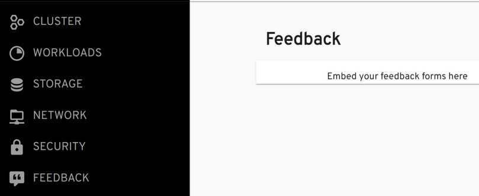
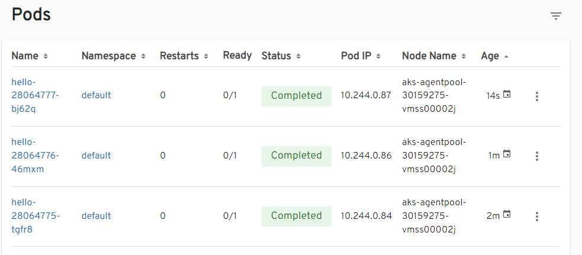
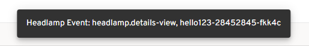
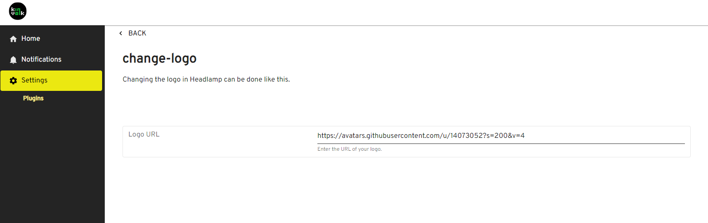

Headlamp's plugins exist to change or add functionality related to
the user interface and experience.

## Plugins Lib

The `@kinvolk/headlamp-plugin` module ships a library
(`@kinvolk/headlamp-plugin/lib`) where all the Headlamp-related development
modules can be found.

The main ones are:

- K8s: Kubernetes related functionality
- Headlamp: To register plugins
- CommonComponents: React components commonly used in the Headlamp UI
- Notification: This module contains two exported members. The first is Notification, a class that can be used to prepare notifications accepted by headlamp. The second is setNotificationsInStore. It's a dispatcher function that accepts a notification object from the Notification class. When called, it brings the notifications from plugin land to the Headlamp ecosystem so that Headlamp can parse the notification and display it.
- Router: To get or generate routes

### Shared Modules

Headlamp ships many common npm modules shared by both the plugins and
Headlamp itself and includes the config files for editors like VS Code
to find them.

These are:

- react
- @iconify-react
- react-redux
- @material-ui/core
- @material-ui/styles
- lodash
- notistack
- recharts

Thus, plugins only need to install dependencies that are not yet provided by Headlamp.
If any dependencies already covered by Headlamp are installed by the plugins, ensure
that they are the same version that Headlamp supports. These will not be bundled when
[building the plugin](./building.md).
Particularly, the mentioned modules will be replaced by their version that's included
in a global object called `pluginLib`.

Older plugin development guides still asked developers to use, e.g., React, in the following
way: `const React: window.pluginLib.React`. But, this is no longer needed.

## Functionality

The plugin registers makes functionality available to plugins in an easy way.

The idea is to make more and more functionality available to plugins. Here is
what we have so far:

### App Bar Action

Show a component in the app bar (in the top right) with
[registerAppBarAction](../api/plugin/registry/functions/registerappbaraction).

- Example plugin shows [How To Register an App Bar Action](https://github.com/headlamp-k8s/headlamp/tree/main/plugins/examples/pod-counter)
- API reference for [registerAppBarAction](../api/plugin/registry/functions/registerappbaraction)

### App Logo

Change the logo (at the top left) with
[registerAppLogo](../api/plugin/registry/functions/registerapplogo).

- Example plugin shows [How To Change The Logo](https://github.com/headlamp-k8s/headlamp/tree/main/plugins/examples/change-logo)
- API reference for [registerAppLogo](../api/plugin/registry/functions/registerapplogo)

### App Menus

Add menus when Headlamp is running as an app.
[Headlamp.setAppMenu](../api/plugin/lib/classes/Headlamp#setappmenu)

- Example plugin shows [How To Add App Menus](https://github.com/headlamp-k8s/headlamp/tree/main/plugins/examples/app-menus)
- API reference for [Headlamp.setAppMenu](../api/plugin/lib/classes/Headlamp#setappmenu)

### Cluster Chooser

Change the Cluster Chooser button (in the middle top of the Headlamp app bar) with
[registerClusterChooser](../api/plugin/registry/functions/registerclusterchooser).

- Example plugin shows [How To Register Cluster Chooser button](https://github.com/headlamp-k8s/headlamp/tree/main/plugins/examples/clusterchooser)
- API reference for [registerClusterChooser](../api/plugin/registry/functions/registerclusterchooser)

### Details View Header Action

Show a component to the top right area of a detail view
(in the area of the screenshot below that's highlighted as yellow)
[registerDetailsViewHeaderAction](../api/plugin/registry/functions/registerdetailsviewheaderaction).

- Example plugin shows [How To set a Details View Header Action](https://github.com/headlamp-k8s/headlamp/tree/main/plugins/examples/details-view)
- API reference for [registerDetailsViewHeaderAction](../api/plugin/registry/functions/registerdetailsviewheaderaction)

### Details View Section

Change sections in cluster resources' details views with [registerDetailsViewSectionsProcessor](../api/plugin/registry/functions/registerdetailsviewsectionsprocessor). This allows you to remove, add, update, or shuffle sections within details views, including the back link.

Or simply append a component at the bottom of different details views with
[registerDetailsViewSection](../api/plugin/registry/functions/registerdetailsviewsection).

- Example plugin shows [How To set a Details View Section](https://github.com/headlamp-k8s/headlamp/tree/main/plugins/examples/details-view)
- API reference for [registerDetailsViewSection](../api/plugin/registry/functions/registerdetailsviewsection)

### Dynamic Clusters

Set a cluster dynamically, rather than have the backend read it from configuration files.
[Headlamp.setCluster](../api/plugin/lib/classes/Headlamp.md#setcluster).

- Example plugin shows [How To Dynamically Set a Cluster](https://github.com/headlamp-k8s/headlamp/tree/main/plugins/examples/dynamic-clusters)
- API reference for [Headlamp.setCluster](../api/plugin/lib/classes/Headlamp.md#setcluster)

### Route

Show a component (in Headlamps main area) at a given URL with
[registerRoute](../api/plugin/registry/functions/registerroute).

- Example plugin shows [How To Register a Route](https://github.com/headlamp-k8s/headlamp/tree/main/plugins/examples/sidebar), and how to remove a route.
- API reference for [registerRoute](../api/plugin/registry/functions/registerroute)
- API reference for [registerRouteFilter](../api/plugin/registry/functions/registerroutefilter)

### Sidebar Item

Add sidebar items (menu on the left) with
[registerSidebarEntry](../api/plugin/registry/functions/registersidebarentry).
Remove sidebar items with [registerSidebarEntryFilter](../api/plugin/registry/functions/registersidebarentryfilter).

- Example plugin shows [How To add items to the sidebar](https://github.com/headlamp-k8s/headlamp/tree/main/plugins/examples/sidebar), and also how to remove sidebar items.
- API reference for [registerSidebarEntry](../api/plugin/registry/functions/registersidebarentry)
- API reference for [registerSidebarEntryFilter](../api/plugin/registry/functions/registersidebarentryfilter)

### Tables

Change what tables across Headlamp show with [registerResourceTableColumnsProcessor](../api/plugin/registry/functions/registersidebarentry). This allows you to remove, add, update, or shuffle table columns.

- Example plugin shows [How to add a context menu to each row in the pods list table](https://github.com/headlamp-k8s/headlamp/tree/main/plugins/examples/tables).
- API reference for [registerResourceTableColumnsProcessor](../api/plugin/registry/functions/registerresourcetablecolumnsprocessor)

### Headlamp Events

Headlamp has the concept of "Headlamp events". Those are fired when something relevant happens in Headlamp.

React to Headlamp events with [registerHeadlampEventCallback](../api/plugin/registry/functions/registerheadlampeventcallback).

- Example plugin shows [How to show snackbars for Headlamp events](https://github.com/headlamp-k8s/headlamp/tree/main/plugins/examples/headlamp-events).
- API reference for [registerHeadlampEventCallback](../api/plugin/registry/functions/registerheadlampeventcallback)

### Plugin Settings

The plugins can have user-configurable settings that can be used to change the behavior of the plugin. The plugin settings can be created using [registerPluginSettings](../api/plugin/registry/functions/registerpluginsettings).

- Example plugin shows [How to create plugin settings and use them](https://github.com/headlamp-k8s/headlamp/tree/main/plugins/examples/change-logo)

