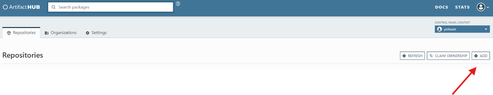
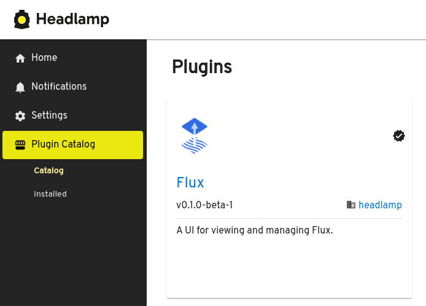

Headlamp at its core does not have a way to make plugins discoverable or to list them to the user. However, the desktop version of Headlamp ships with the [Plugin Catalog](URL_FOR_PLUGIN) plugin, which does provide a way for users to list Headlamp plugins from [ArtifactHub](https://artifacthub.io), install and remove them.

This section of the docs is a guide for how to publish a Headlamp plugin to ArtifactHub.

## Prerequisites

* A GitHub repository containing your Headlamp plugin code. See the [building](./building.md) section to learn how to implement a Headlamp plugin.

## Step 1: Create an ArtifactHub repository file

ArtifactHub will need to know that you own the repository you set up for your plugins (this is done in a later step in this guide). So start by creating a file called `artifacthub-repo.yml` at the root of your GitHub repository with the following content:

```yaml
owners:
- name: <Your Name>
  email: <your-email@example.com>
```

Replace `<Your Name>` and `<your-email@example.com>` with your name and email, respectively.

## Step 2: Build and Release Your Plugin on GitHub

1. Move to your plugin’s folder, then run the following command:
  ```bash
  npm install
  npm run build
  npm run package
  ```
  It will create a tarball of the plugin in a Headlamp-accepted format and also print the checksum of the tarball that we will use in the next step.

2. Create a new release on GitHub for your plugin.

3. Tag the release with a semantic version number (e.g., v1.0.0).

4. Upload the built plugin files as assets to this release.

For detailed instructions on creating a new release, refer to the [GitHub documentation](https://docs.github.com/en/repositories/releasing-projects-on-github/managing-releases-in-a-repository).

:::info
For security reasons, Headlamp allows the download of plugins exclusively from GitHub, GitLab, and BitBucket. While this may change in the future, if you need your plugins to be downloaded from somewhere else, please [let us know](https://github.com/kubernetes-sigs/headlamp/issues).

Also, by default the Plugin Catalog only shows plugins marked as official in ArtifactHub, or allow-listed by Headlamp. Users can override this behavior and make Headlamp show all the plugins by switching off the "Only official plugins" setting for the Plugin Catalog. Read more at the [Plugin Catalog README](https://github.com/headlamp-k8s/plugins/tree/main/plugin-catalog#readme).
:::

## Step 3: Create an ArtifactHub package for the plugin

ArtifactHub needs to detect that you have a Headlamp plugin in your repository, and read the data about it. For that, we need an ArtifactHub package file in the repo for each plugin we have. For that, create an `artifacthub-pkg.yml` file in the root of your repository  with the following content:

```yaml
version: 0.1.0
name: <Your Plugin Name>
displayName: <Your Plugin Display Name>
createdAt: "2024-07-18T05:35:50Z"
logoURL: <Your Plugin Logo URL>
description: <Your Plugin Description>
annotations:
  headlamp/plugin/archive-url: <Your Plugins Archive URL>
  headlamp/plugin/archive-checksum: <Checksum of the tarball>
  headlamp/plugin/version-compat: <Version>
  headlamp/plugin/distro-compat: <Compatibility of your plugin>
```

Replace the placeholders with appropriate values. For more information, refer to the [Artifact Hub documentation](https://artifacthub.io/docs/topics/annotations/headlamp/). A sample configuration can be found [here](https://github.com/headlamp-k8s/plugins/blob/main/opencost/artifacthub-pkg.yml).

## Step 4: Push Changes to GitHub

Commit and push the `artifacthub-repo.yml` and `artifacthub-pkg.yml` files to your GitHub repository:

```sh
git add artifacthub-repo.yml artifacthub-pkg.yml
git commit -m "Add Artifact Hub configuration"
git push origin main
```

## Step 5: Register your repository in Artifact Hub

1. Navigate to [Artifact Hub](https://artifacthub.io/).
2. Sign in or create an account.
3. Click on "Add" in your Control Panel.
4. Select "Headlamp plugin" as the repository kind.
5. Enter the Name and GitHub repository URL.
6. Click "Add" to submit.

**Control Panel part of ArtifactHub:**


**Adding a repo in ArtifactHub:**


Artifact Hub will scan your repository. If everything is configured correctly, your plugin will be listed.

## Conclusion

Congratulations! You've successfully published your Headlamp plugin to Artifact Hub. Your plugin is now discoverable and available for others to use*. For more detailed information on configurations and best practices, refer to the [Artifact Hub documentation](https://artifacthub.io/docs/topics/repositories/headlamp-plugins) and the [Headlamp plugin development guide](https://headlamp.dev/docs/latest/development/plugins/).

**Plugin example in the Plugin Catalog:**

