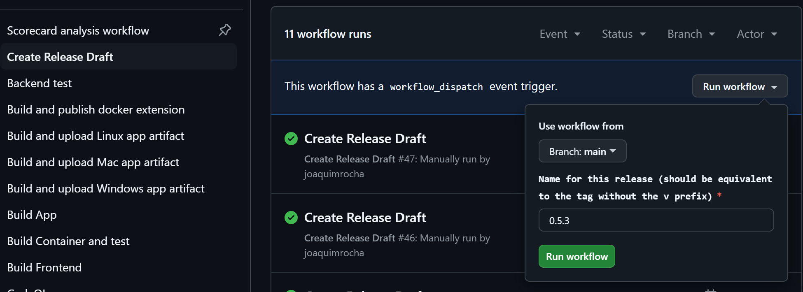

This document describes how to perform a Headlamp release.

The idea is that we list the steps here as a guide and automate it along the way, so the number of steps is reduced as much as possible in the future.

## Version bumping

We follow the [semantic versioning](https://semver.org/) guide.

## Steps to perform a Headlamp release  

When ready to perform a release (changes worth releasing since last time is done, QA is done), then:

### 1. Create a new branch

Create a new branch called "rc-X.Y.Z" where X.Y.Z is the new release version.

### 2. Bump the app “version”

On the main branch, bump the “version” field in app/package.json, run "npm i" inside app/ and commit with:

```shell
git commit app/package* -m "app: Bump version to X.Y.Z"
```

Bug fix: make a branch off the tag, and cherry pick everything in. Or make a branch off main and remove merge commits compared to previous tag (On the branch to remove merge commits, do: "`git rebase main`").

```shell
git log v0.25.0.. --oneline
```


### 3. Start a release draft

Start a release draft by manually running the "Create release draft" action (it's important to give it the right release name as it creates links with that number in the draft):



### 4. Check the list of changes since the last release

Check the list of changes since the last release:

```
git log \`git describe \--abbrev=0\`..
```

Then go to the release draft created in the previous step and fill it accordingly.

Look at previous releases. Write for humans: no context part, like "frontend:". Put github user name in "(thanks @XXX )" at end of line for external contributors.


### 5. App signing

The build scripts handle app signing.

### 6. Generate Apps

Generate the apps for each the Linux, Windows, and Mac platforms by running the "Build and upload PLATFORM artifact" actions against the "rc-X.Y.Z".

### 7. Download and test Artifacts

Download the artifacts, test them and, if everything goes well, upload them to the new release's assets area.

### 8. Push Assets

Upload the binary to the release's assets with the script.

Run the push-assets.js script for pushing assets. This script pushes the assets and automatically sets the right type for them. It also updates and uploads a checksums file:

```shell
   GITHUB_TOKEN=MY_TOKEN_123 node ./app/scripts/push-release-assets.js v0.19.0 Headlamp....tar.gz
```

Note: If you use the gh command line tool, you can use `gh auth token`. To create a new GITHUB_TOKEN, see the document [Managing your personal access tokens](https://docs.github.com/en/authentication/keeping-your-account-and-data-secure/managing-your-personal-access-tokens).


### 9. Push the new tag

Go to the main branch and merge the rc-X.Y.Z in, then tag the branch (notice the **v** before the version number):

```shell
git tag vX.Y.Z \-a \-m “Release X.Y.Z”
```


Push the new release commit and tags:

Note: DO NOT RUN THIS BELOW EXCEPT ON NEW FEATURE RELEASES.

```shell
git checkout main

git merge rc-X.Y.X \# (this should NOT create a merge commit since the bump commit is the only difference)

git push origin main

git push \--tags
```

### 10. Container images and distribution channels (flathub, homebrew)

Container images are built automatically on every tag creation and pushed to the GitHub Container Registry (ghcr.io).

Other distribution channels like flathub, homebrew, minikube, will be done by automatically opened PRs.

### 11. Announce on social media

Ask someone in the social team (Joaquim or Chris) to toot/tweet/post about it from the social media accounts.
