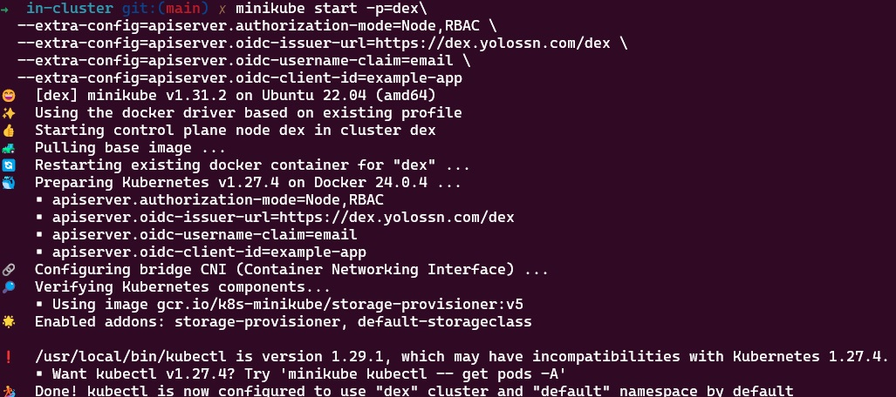
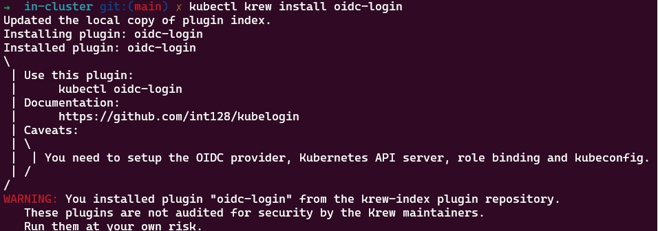
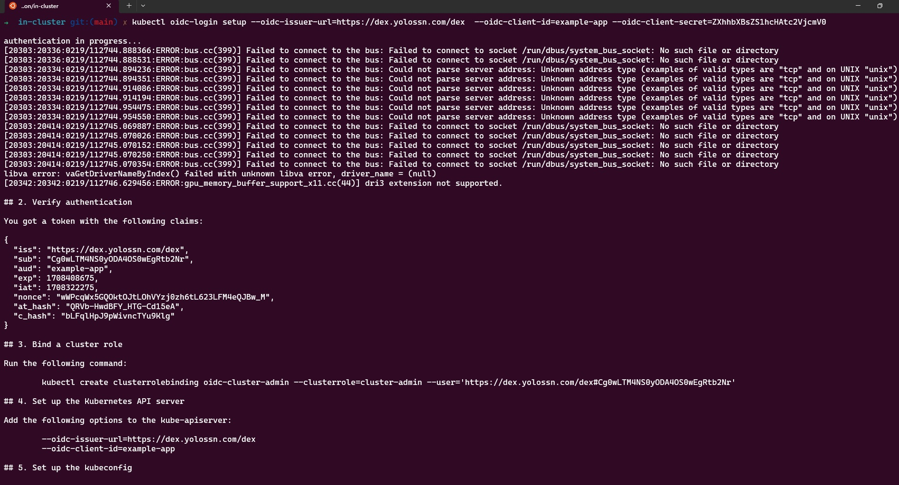
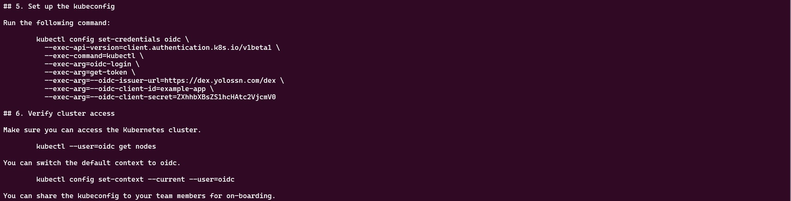
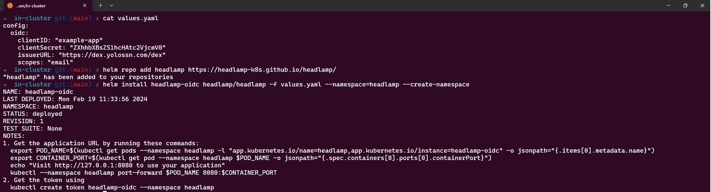
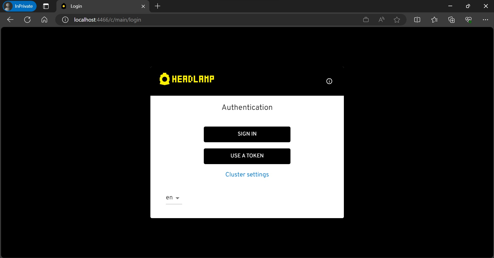
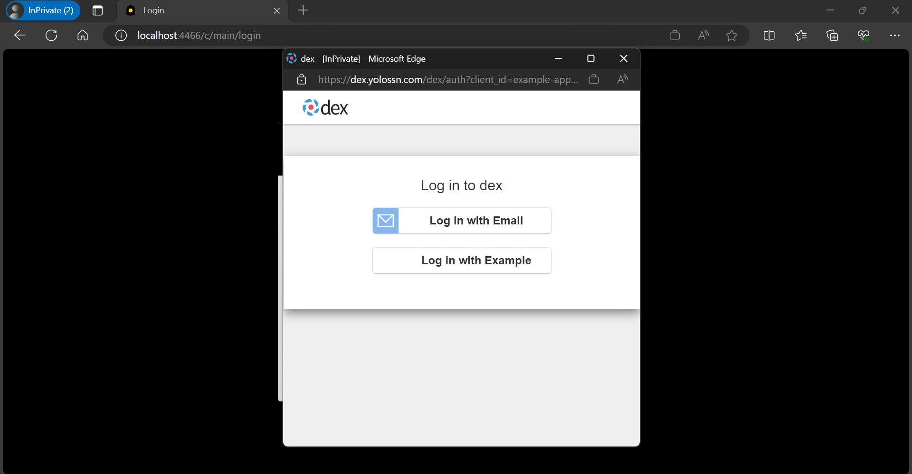
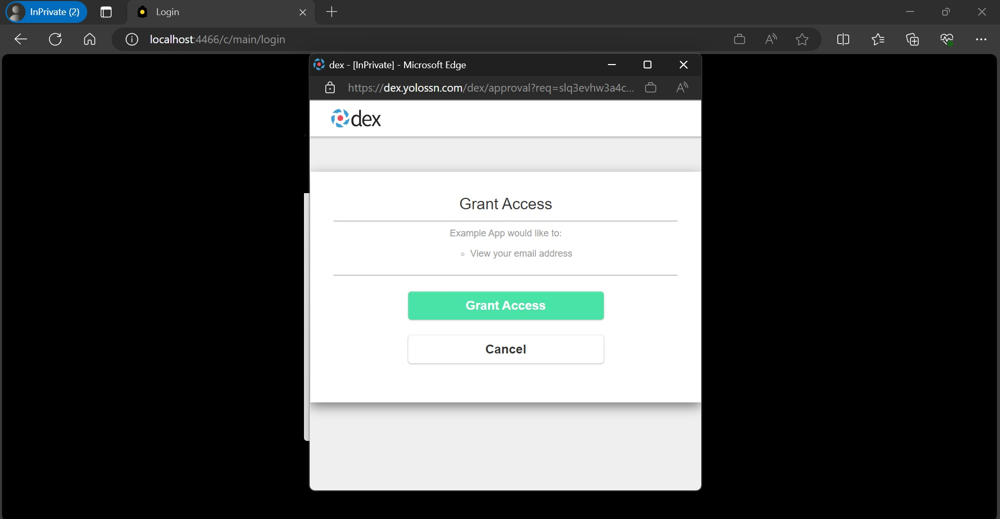
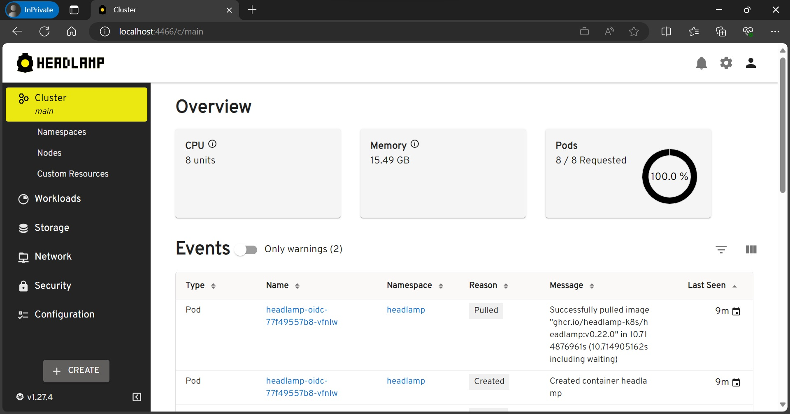

In this tutorial, we'll walk through the process of configuring Headlamp within a Minikube cluster while utilizing Dex for OIDC (OpenID Connect) authentication. This tutorial is based on Dex version 2.38.0, Minikube version v1.31.2, and Headlamp version 0.22.0.


## Configuring Dex

To enable OIDC authentication in your Minikube cluster, you'll need to configure Dex. Before proceeding, follow the [getting started guide](https://dexidp.io/docs/getting-started/) to set up your Dex instance.Follow these steps to configure Dex:

1. Create a Dex configuration file. The following example demonstrates a basic configuration file for Dex, containing a 
static client, connector, and static password.

**dex-config.yaml**

```yaml
issuer: <YOUR-DEX-URL>

storage:
  type: sqlite3

web:
  http: 0.0.0.0:5556

staticClients:
- id: example-app
  redirectURIs:
  - 'http://localhost:8000'
  name: 'Example App'
  secret: ZXhhbXBsZS1hcHAtc2VjcmV0

connectors:
- type: mockCallback
  id: mock
  name: Example

# Let dex keep a list of passwords which can be used to login to dex.
enablePasswordDB: true

staticPasswords:
- email: "admin@example.com"
  # bcrypt hash of the string "password": $(echo password | htpasswd -BinC 10 admin | cut -d: -f2)
  hash: "$2a$10$2b2cU8CPhOTaGrs1HRQuAueS7JTT5ZHsHSzYiFPm1leZck7Mc8T4W"
  username: "admin"
  userID: "08a8684b-db88-4b73-90a9-3cd1661f5466"
```
2. Start Dex with the following command:

```shell
dex serve dex-config.yaml
```

## Setting up Minikube with the Dex OIDC Configuration

To configure Minikube for Dex OIDC integration, follow these steps:

1. **Run the following command** to start Minikube with the necessary configuration options:

```shell
minikube start -p=dex \
--extra-config=apiserver.authorization-mode=Node,RBAC \
--extra-config=apiserver.oidc-issuer-url=https://<YOUR-DEX-URL> \
--extra-config=apiserver.oidc-username-claim=email \
--extra-config=apiserver.oidc-client-id=<CLIENT-ID>
```



Note:
Replace `<YOUR-DEX-URL>` with the actual URL of your Dex instance and `<CLIENT-ID>` with the actual client ID.

## Configuring a ClusterRole Binding for the OIDC User

Once your cluster is operational, you need to configure a cluster role and a cluster role binding for the Dex user. This step is essential for enabling the Kubernetes API server to identify the user. In this example, we'll be associating the user with the predefined `cluster-admin` Role.

**clusterRoleBinding.yaml**

```yaml
apiVersion: rbac.authorization.k8s.io/v1
kind: ClusterRoleBinding
metadata:
  name: admin-user-clusterrolebinding
subjects:
- kind: User
  name: admin@example.com
  apiGroup: rbac.authorization.k8s.io
roleRef:
    kind: ClusterRole
    name: cluster-admin
    apiGroup: rbac.authorization.k8s.io
```

Create the cluster role binding by running the following command:

```shell
kubectl apply -f clusterRoleBinding.yaml
```

## Configuring kubectl for OIDC User Authentication

Once you've set up your cluster and created a ClusterRoleBinding, it's time to configure `kubectl` to work with your OIDC user for authentication. Follow these steps:

1. Install the `oidc-login` plugin with [krew](https://krew.sigs.k8s.io/docs/user-guide/quickstart/) by executing the following command:

```shell
kubectl krew install oidc-login
```


2. Set Up `oidc-login`, Configure oidc-login with the necessary parameters by running the following command:

```shell
kubectl oidc-login setup --oidc-issuer-url=https://<YOUR-DEX-URL> \ --oidc-client-id=<CLIENT-ID> \
--oidc-client-secret=<CLIENT-SECRET>
```





3. Create OIDC User for the Cluster, later this user will be mapped to the dex cluster.

```shell
kubectl config set-credentials oidc-user \
  --exec-api-version=client.authentication.k8s.io/v1beta1 \
  --exec-command=kubectl \
  --exec-arg=oidc-login \
  --exec-arg=get-token \
  --exec-arg=--oidc-issuer-url=<YOUR-DEX-URL> \
  --exec-arg=--oidc-client-id=<CLIENT-ID> \
  --exec-arg=--oidc-client-secret=<CLIENT-SECRET> \
  --exec-arg=--oidc-extra-scope=email
```

4. Link the User to the Cluster: To associate the user with the cluster, create a new context by running the following commands:

```shell
kubectl config set-context dex-oidc --namespace=default --cluster=dex --user=oidc-user
kubectl config use-context dex-oidc
```

5. Test the Configuration: To verify that the configuration is working, list the namespaces in the cluster by executing the command:

```shell
kubectl get ns
```

Upon running this command, a new browser window will open, prompting you to log in. Once you've completed the login process, you can close the window. You should see the namespaces in your cluster.


# Setting up Headlamp with Dex OIDC Authentication

To configure Headlamp, you can use the Headlamp Helm chart. Follow these steps to set it up with OIDC(OpenID Connect) authentication:

1. Before setting up Headlamp add `http://localhost:4466/oidc-callback` to the `redirectURIs`
in the Dex configuration.


2. Create a `values.yaml` file and add the following OIDC configuration to it:

```yaml
config:
    oidc:
    clientID: "<YOUR-CLIENT-ID>"
    clientSecret: "<YOUR-CLIENT-SECRET>"
    issuerURL: "<YOUR-DEX-URL>"
    scopes: "email"
```

Replace `<YOUR-CLIENT-ID>`,`<YOUR-CLIENT-SECRET>`,`<YOUR-DEX-URL>` with your specific OIDC configuration details.

3. Save the `values.yaml` file and Install Headlamp using helm with the following commands:

```shell
helm repo add headlamp https://headlamp-k8s.github.io/headlamp/
helm install headlamp-oidc headlamp/headlamp -f values.yaml --namespace=headlamp --create-namespace
```



This will install Headlamp in the headlamp namespace with the OIDC configuration from the values.yaml file.


4. After a successful installation, you can access Headlamp by port-forwarding to the pod:

```shell
kubectl port-forward svc/headlamp-oidc 4466:80 -n headlamp
```

5. Open your web browser and go to http://localhost:4466. Click on "sign-in." After completing the login flow successfully, you'll gain access to your Kubernetes cluster using Headlamp.






## Conclusion

In this tutorial, we've explore the process of setting up Headlamp within a Kubernetes cluster, integrating it with OIDC (OpenID Connect) authentication provided by Dex. By following the steps outlined in this guide, you've successfully configured Headlamp to enhance your Kubernetes cluster management.

This setup allows you to benefit from Headlamp's user-friendly interface and advanced features, all while ensuring a secure and streamlined authentication through Dex. With the power of OIDC, you can easily and safely access and manage your Kubernetes resources.
