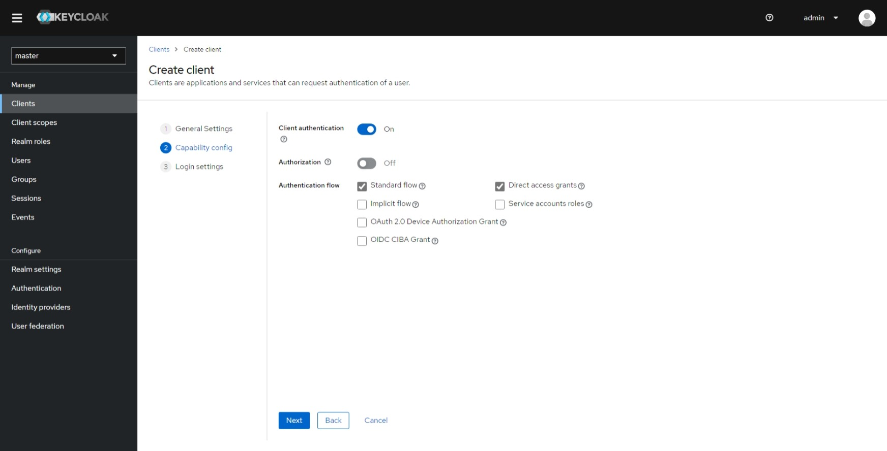

# How to Set Up Headlamp in a Minikube Cluster with Keycloak OIDC Authentication

In this tutorial, we'll walk through the process of configuring Headlamp within a Minikube cluster while utilizing Keycloak for OIDC (OpenID Connect) authentication. This tutorial is based on Keycloak version 22.0.4, Minikube version v1.31.2, and Headlamp version 0.20.1.

Note: This tutorial assumes that you have Keycloak hosted on a remote server. If you're using a local Keycloak instance, you may encounter issues with Minikube OIDC configuration.

## Creating a Keycloak Client

To enable OIDC authentication in your Minikube cluster, you'll need to create a Keycloak client.Before proceeding, follow the [getting started guide](https://www.keycloak.org/guides#getting-started) to set up your Keycloak instance. When creating a user in Keycloak, don't forget to also set the email address.Follow these steps to configure the client in your Keycloak admin panel:

1. Start by accessing your Keycloak admin panel.
> \<YOUR-KEYCLOAK-URL\>/admin


2. Navigate to the "Clients" section and Click on the "Create client" option.


3. Fill in the "client-id" and "Name" fields and proceed to the next step.


4. In the "Capability Config" step, enable "Client authentication" and proceed to the next step.


5. Add "http://localhost:8000/*" to the "Valid redirect URIs" and save your settings.


## Setting up Minikube with the Keycloak OIDC Configuration

To configure Minikube for Keycloak OIDC integration, follow these steps:

1. **Run the following command** to start Minikube with the necessary configuration options:

```shell
minikube start -p=keycloak \
--extra-config=apiserver.authorization-mode=Node,RBAC \
--extra-config=apiserver.oidc-issuer-url=<YOUR-KEYCLOAK-URL>/realms/<REALM-NAME> \
--extra-config=apiserver.oidc-username-claim=email \
--extra-config=apiserver.oidc-client-id=<CLIENT-ID>
 ```


Note: 
Replace `<YOUR-KEYCLOAK-URL>`, `<REALM-NAME>`, and `<CLIENT-ID>` with the actual values relevant to your Keycloak setup.

## Configuring a ClusterRole Binding for the OIDC User

Once your cluster is operational, you need to configure a cluster role and a cluster role binding for the user in your Keycloak realm. This step is essential for enabling the Kubernetes API server to identify the user. In this example, we'll be associating the user with the predefined `cluster-admin` Role.

**clusterRoleBinding.yaml**

```yaml
apiVersion: rbac.authorization.k8s.io/v1
kind: ClusterRoleBinding
metadata:
  name: admin-user-clusterrolebinding
subjects:
- kind: User
  name: <USER-EMAIL>   # Please note that the name is case-sensitive
  apiGroup: rbac.authorization.k8s.io
roleRef:
  kind: ClusterRole
  name: cluster-admin    # Specify the name of the ClusterRole to be bound
  apiGroup: rbac.authorization.k8s.io
```
Note: Please replace `<USER-EMAIL>` with your keycloak user email.

Create the cluster role binding by running the following command:

```shell
 kubectl apply -f clusterRoleBinding.yaml
```

# Configuring kubectl for OIDC User Authentication

Once you've set up your cluster and created a ClusterRoleBinding, it's time to configure `kubectl` to work with your OIDC user for authentication. Follow these steps:

1. Install the `oidc-login` plugin with [krew](https://krew.sigs.k8s.io/docs/user-guide/quickstart/) by executing the following command:
```shell
 kubectl krew install oidc-login
```


2. Set Up `oidc-login`, Configure oidc-login with the necessary parameters by running the following command:

```shell
  kubectl oidc-login setup \
  --oidc-issuer-url=<YOUR-KEYCLOAK-URL>/realms/<REALM-NAME> \
  --oidc-client-id=<CLIENT-ID> \
  --oidc-client-secret=<CLIENT-SECRET>
```


Note: You can find the `<CLIENT-SECRET>` from the Credentials tab of your client details page in Keycloak.

3. Create OIDC User for the Cluster, later this user will be mapped to the keycloak cluster.

```shell
kubectl config set-credentials keycloak-oidc \
  --exec-api-version=client.authentication.k8s.io/v1beta1 \
  --exec-command=kubectl \
  --exec-arg=oidc-login \
  --exec-arg=get-token \
  --exec-arg=--oidc-issuer-url=<YOUR-KEYCLOAK-URL>/realms/<REALM-NAME> \
  --exec-arg=--oidc-client-id=<CLIENT-ID> \
  --exec-arg=--oidc-client-secret=<CLIENT-SECRET> \
  --exec-arg=--oidc-extra-scope=email,profile
```

4. Link the User to the Cluster: To associate the user with the cluster, create a new context using these commands:


```shell
kubectl config set-context keycloak-oidc --namespace=default --cluster=keycloak --user=keycloak-oidc
kubectl config use-context keycloak-oidc
```

5. Test the Configuration: To verify that the configuration is working, list the namespaces in the cluster by executing the command:

```shell
kubectl get ns
```

Upon running this command, a new browser window will open, prompting you to log in. Once you've completed the login process, you can close the window. You should see the namespaces in your cluster.

Note: Make sure to replace `<YOUR-KEYCLOAK-URL>`, `<REALM-NAME>`, `<CLIENT-ID>`, and `<CLIENT-SECRET>` with your specific Keycloak configuration details wherever necessary.


# Setting up Headlamp with OIDC Configuration

To configure Headlamp, you can use the Headlamp Helm chart. Follow these steps to set it up with OIDC (OpenID Connect) authentication:

1. Before setting up Headlamp Go to Keycloak Admin Dashboard, click on Client > Client Details and Edit Client, Add `http://localhost:4466/oidc-callback` to the list of `Valid redirect URIs`.


2. Create a `values.yaml` file and add the following OIDC configuration to it:

```yaml
config:
  oidc:
    clientID: "<YOUR-CLIENT-ID>"
    clientSecret: "<YOUR-CLIENT-SECRET>"
    issuerURL: "<YOUR-KEYCLOAK-URL>/realms/<REALM-NAME>"
    scopes: "email,profile"
 ```

Replace `<YOUR-CLIENT-ID>`, `<YOUR-CLIENT-SECRET>`, `<YOUR-KEYCLOAK-URL>`, and `<REALM-NAME>` with your specific OIDC configuration details.

3. Save the `values.yaml` file and Install Headlamp using helm with the following commands:

```shell
helm repo add headlamp https://headlamp-k8s.github.io/headlamp/
helm install headlamp-oidc headlamp/headlamp -f values.yaml --namespace=headlamp --create-namespace
```


This will install Headlamp in the headlamp namespace with the OIDC configuration from the values.yaml file.


4. After a successful installation, you can access Headlamp by port-forwarding to the pod:

```shell
kubectl port-forward svc/headlamp-oidc 4466:80 -n headlamp
```

5. Open your web browser and go to http://localhost:4466. Click on "sign-in." After completing the login flow successfully, you'll gain access to your Kubernetes cluster using Headlamp.


## Conclusion

In this tutorial, we've explored the process of setting up Headlamp within a Kubernetes cluster, integrating it with OIDC (OpenID Connect) authentication provided by Keycloak. By following the steps outlined in this guide, you've successfully configured Headlamp to enhance your Kubernetes cluster management.

This setup allows you to benefit from Headlamp's user-friendly interface and advanced features, all while ensuring a secure and streamlined authentication through Keycloak. With the power of OIDC, you can easily and safely access and manage your Kubernetes resources.