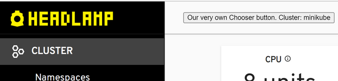

# Example Plugin: ClusterChooserButton override

This example plugin shows how to override the default available "cluster-chooser" button.



To run the plugin with [node.js](https://nodejs.org/en/) installed:

```bash
git clone git@github.com:kinvolk/headlamp.git
cd headlamp/plugins/examples/cluster-chooser/
npm install
npm start
# See the changed cluster chooser button in the top middle of Headlamp
```

The main code for the plugin is in [src/index.tsx](src/index.tsx).

## Further information

See:

- API documentation for [registerClusterChooser](https://headlamp.dev/docs/latest/development/api/modules/plugin_registry/#registerclusterchooser)
- The [getting started documentation for Headlamp plugin development](https://headlamp.dev/docs/latest/development/plugins/building/)
